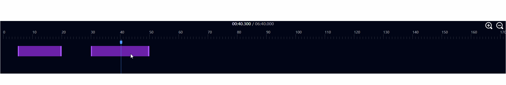

# 描述

这是一个剪辑用的时间轴组件

# 效果预览



# 使用方法

## 传入参数（通过prop）

```typescript
totalTime:number //视频总时长(单位为毫秒)
clips:[{startTime:number,endTime:number}] //切片的开始时间和结束时间，单位为毫秒
```


## emit事件

```typescript
timeCursorChange: (newTime:number) //时间游标位置被改变（时间游标是指蓝色的那个）
clipDurationChange: ({index : number, clip : {startTime:number,endTime:number}}) //切片的起始时间被更改，index表示该切片的下标，这个下标对应了prop里给的clips的下标
```

## expose方法

```typescript
setTimeCursorTime(newTime : number) //设置当前时间下标的时间
```
